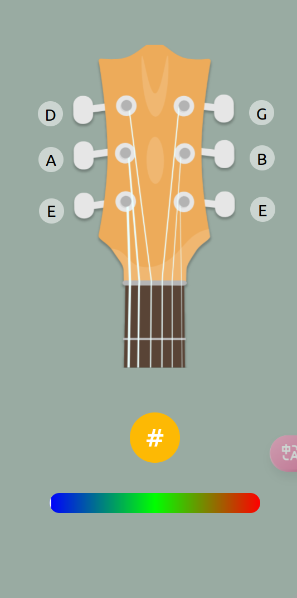
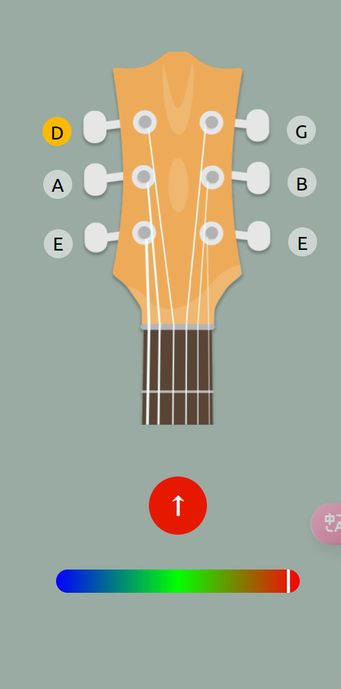

# Guitar Tuner Purely Based on HTML5 + JS

## Overview
This project provides a simple guitar tuner application built purely using HTML5 and JavaScript. It allows users to select a guitar string, then automatically detects the frequency of the input audio signal from the microphone and indicates whether the selected string is in tune.

  

## Features
- **Frequency Detection**: Uses Web Audio API to analyze the frequency of sound captured by the user's microphone.
- **String Selection**: Users can click on buttons corresponding to each guitar string (E, A, D, G, B, E) to select which string they are tuning.
- **Visual Feedback**: Provides real-time visual feedback showing how close the detected frequency is to the target frequency for the selected string.
- **Dynamic Positioning**: Buttons dynamically adjust their position based on predefined rules, making it adaptable for various screen sizes or layouts.

## Installation
Since this project is purely based on HTML5 and JavaScript, there is no installation required. Simply download the files and open the `index.html` file in your web browser.

## Usage
1. **Open the Application**: Open the `index.html` file in a modern web browser that supports Web Audio API.
2. **Select a String**: Click one of the buttons labeled with the names of the guitar strings (E, A, D, G, B, E). This sets the target frequency for tuning.
3. **Allow Microphone Access**: When prompted, allow the app to access your microphone.
4. **Tune Your Guitar**: Play the selected string on your guitar and watch the indicator move towards the correct tuning. The text inside the `.hz-now` div will show "√" if correctly tuned, "↑" if too high, and "↓" if too low.

## Code Structure
### HTML
- Contains the structure for buttons representing guitar strings, the progress bar, and the indicator.
  
### CSS
- Styles for the buttons, progress container, indicator, and other UI elements. Includes a gradient background for the progress bar and dynamic coloring for the indicator based on tuning accuracy.

### JavaScript
- Implements core functionalities such as:
  - Initializing the application and setting up button positions.
  - Handling audio stream processing to detect frequencies.
  - Managing a queue of recent frequency readings to smooth out detection.
  - Providing visual feedback through updating the indicator's position and color.

## Functions Overview
- `initialize()`: Sets up initial conditions when the page loads, including requesting microphone permissions and positioning buttons.
- `selectString(id)`: Changes the background color of the clicked button and updates the tuning message with the selected string's frequency.
- `getPosition(element)`: Returns the element's position relative to the document.
- `setPosition(element, top, left)`: Dynamically sets the absolute position of an element.
- `use_stream(stream)`: Processes the audio stream to detect frequencies and update the UI accordingly.

## Note
Ensure you have a functioning microphone connected to your device for accurate frequency detection. Due to differences in hardware and environment, actual performance may vary. 

## Reference
- core algorithm to get the frequency  [Rhythm](https://github.com/akhileshdevrari/Rhythm)